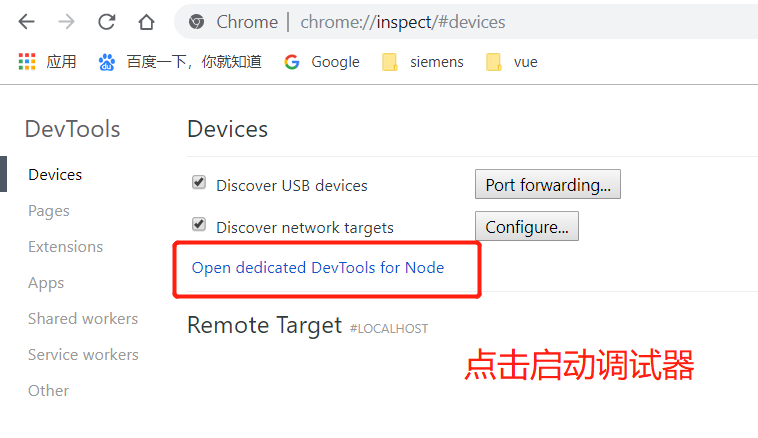

### 数据转换

_读取 rdf 文件,将其转成 JSON 保存到数据库中_

#### 提取属性

```js
const cheerio = require("cheerio");

// 解析rdf文件
module.exports = rdf => {
  const $ = cheerio.load(rdf);
  const book = {};
  // 转换bookId此处的+号是为了保证结果为数字
  book.id = +$("pgterms\\:ebook")
    .attr("rdf:about")
    .replace("ebooks/", "");
  book.title = $("dcterms\\:title").text();
  // 获取作者,作者是数组 element返回的是文档节点,需要使用$包装获取,实现作者Array
  book.authers = $("pgterms\\:agent pgterms\\:name")
    .toArray()
    .map(element => $(element).text());
  // 获取主题列表
  book.subjects = $('[rdf\\:resource$="/LCSH"]')
    .parent()
    .find("rdf\\:value")
    .toArray()
    .map(element => $(element).text());
  return book;
};
```

#### 批量转换 rdf 文件

```bash
$ npm install --save --save-exact node-dir@0.1.16
```

```js
"use strict";
// 批量 rdf to json

const dir = require("node-dir");
const parseRDF = require("./lib/parse-rdf.js");
const dirname = process.argv[2];

const options = {
  match: /\.rdf$/,
  exclude: ["pg0.rdf"]
};

// 使用node-dir遍历目录树
dir.readFiles(dirname, options, (err, content, next) => {
  if (err) {
    throw err;
  }
  const doc = parseRDF(content);
  // es id
  console.log(JSON.stringify({ index: { _id: `pg${doc.id}` } }));
  console.log(JSON.stringify(doc));
  next();
});
```

### chrome devtools 工具

#### debug 调试程序

```bash
$ node --inspect rdf-to-json-bulk.js(debug的js) ../../cache/epub(此js对应的参数)
```

#### DevTools 设备页面

地址栏输入`chrome://inspect`进入 DevTools 设备页面


