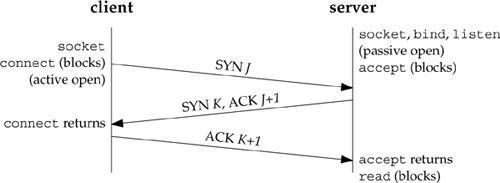

## Socket网络编程

### TCP三次握手



* 第一次: client发送一个SYN(J)包给server，然后等待server的ACK回复，进入SYN-SENT状态。
  p.s: SYN为synchronize的缩写，ACK为acknowledgment的缩写。
* 第二次: server接收到SYN(seq=J)包后就返回一个ACK(J+1)包以及一个自己的**SYN(K)**包，然后等待client的ACK回复，server进入SYN-RECIVED状态。
* 第三次: client接收到server发回的ACK(J+1)包后，进入ESTABLISHED状态。然后根据server发来的SYN(K)包，返回给等待中的server一个ACK(K+1)包。等待中的server收到ACK回复，也把自己的状态设置为ESTABLISHED。到此TCP三次握手完成，client与server可以正常进行通信了。<br/>
*来源: https://juejin.im/post/5a7835a46fb9a063606eb801*

### 1.监听socket连接
*基于服务端和客户端连接,服务端绑定TCP端口号,客户端订阅此端口号实现Socket监听*

#### 给服务端绑定TCP端口
``` js
const server = net.createServer(connection => {
// 成功绑定60300端口号后或将socket对象传递给connection
}).listen(60300, () => console.log('Listen for subscribers ...'));

```

#### 服务端watch文件
``` js
const fs = require('fs');
const net = require('net');
const fileName = process.argv[2];
if (!fileName) {
    throw Error('filename can not be null!');
}
// 创建连接
const server = net.createServer(connection => {

    // 有客户端成功连接就会提示
    console.log('Subscriber connected!');
    console.log(`Now Watching "${fileName}" for changes ... \n`);

    // 监听文件变化,输出到客户端的控制台
    const watcher = fs.watch(fileName, () => {
        connection.write(`File changed: ${new Date()} \n`);
    });

    connection.on('close', () => {
        console.log('Subscriber disconnected!');
        watcher.close();
    });
    connection.on('error', () => {
        console.log('err: ', error);
    })
    // 监听60300端口
}).listen(60300, () => console.log('Listen for subscribers ...'));
```
#### 1s循环创建target文件
``` bash
$ watch -n 1 touch target.txt
```

#### 使用telnet客户端
``` bash
$ telnet localhost 60300
```

#### 流程分析
*Socket服务绑定主机的TCP端口号,客户端通过主机的TCP端口号与服务端实现连接,服务端监听到file文件的修改,输出内容到客户端,此过程是单向的*

### 2.实现Json格式的数据传递&自定义socket客户端

#### 服务端
``` js
const server = net.createServer(connection => {

    // 有客户端成功连接就会提示
    console.log('Subscriber connected!');
    console.log(JSON.stringify({ "type": "watching", "filename": fileName }) + '\n');

    // 监听文件变化,输出到客户端的控制台
    const watcher = fs.watch(fileName, () => {
        connection.write(JSON.stringify({ "type": "changed", "timestamp": Date.now() }) + '\n');
    });

    connection.on('close', () => {
        console.log('Subscriber disconnected!');
        watcher.close();
    });
    connection.on('error', () => {
        console.log('err: ', error);
    })
    // 监听60300端口
}).listen(60300, () => console.log('Listen for subscribers ...'));
```

#### 自定义客户端
``` js
const net = require('net');
// 连接指定端口号
const client = net.connect({ port: 60300 });
client.on('data', (data) => {
    const message = JSON.parse(data);
    if (message.type === 'watching') {
        console.log(`Now watching: ${message.file}`);
    } else if (message.type === 'changed') {
        const date = new Date(message.timestamp);
        console.log(`File changed: ${date}`)
    } else {
        console.log(`unrecongnized message type: ${message.type}`);
    }
});
client.on('error', err => { throw err });
```

### 3.实现消息分块发送与接收
*1.数据缓存加工成消息 2.对接收的消息进行处理和响应*

#### 实现自定义分段发送JSON数据的服务端

``` js
const net = require('net');
const fs = require('fs');
net.createServer(connection => {
    console.log('Subscriber connected');

    let timer;
    const watcher = fs.watch(process.argv[2], () => {
        const date = Date.now();
        // 每监测到文件变化,就将以下两部分数据分次发送到client
        const firstChunk = '{"type":"watching","timest';
        const secondChunk = `amp": ${date}}\n`;
        console.log(`File changed: ${date}`);
        connection.write(firstChunk);
        connection.write(secondChunk);
    })

    connection.on('close', () => {
        console.log('Subscriber disconnected');
        watcher.close();
    });
}).listen(60300, () => console.log('Listen for subscriber ...'));
```

#### 实现自定义LDJ(基于JSON)缓存模块解决消息分块问题

``` js
// 实现一个自定义LDJ缓存模块来解决JSON分块消息的问题
const EventEmitter = require('events').EventEmitter;
class LDJClient extends EventEmitter {
    constructor(stream) {
        super();
        // 初始化字符串
        let buffer = '';
        stream.on('data', data => {
            // 将data值赋给buffer
            buffer += data;
            let boundary = buffer.indexOf('\n');
            // 发过来的消息中没有\n就缓存,有\n就发送
            while (boundary !== -1) {
                const input = buffer.substring(0, boundary);
                // 获取\n剩下的内容
                buffer = buffer.substring(boundary + 1);
                // 传输一个完整的消息出去
                this.emit('message', JSON.parse(input));
                // 继续判断剩下的内容中是否有\n,有就循环执行
                boundary = buffer.indexOf('\n');
            }
        });
    }
    // 自定义static方法提供快速创建实例
    static connect(stream){
        return new LDJClient(stream);
    }
}
module.exports = LDJClient;
```

#### 导入&导出自定义类(以LDJClient为例)

* 导出
``` js
module.exports = LDJClient;
```

* 导入
``` js
const ldjClient = require('./lib/ldj-client.js').connect(netClient);
```

#### 自定义客户端接收分段数据

``` js
// 从原有的直接消费TCP流变成由ldj-client.js处理流
const netClient = require('net').connect({ port: 60300 });
const ldjClient = require('./lib/ldj-client.js').connect(netClient);
ldjClient.on('message', message => {
    if (message.type === 'watching') {
        console.log(`Now watching: ${message.timestamp}`);
    } else if (message.type === 'changed') {
        const date = new Date(message.timestamp);
        console.log(`File changed: ${date}`)
    } else {
        console.log(`unrecongnized message type: ${message.type}`);
    }
});
```
