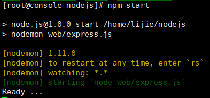

### Restful web 服务

#### Express 使用 demo

_Express 是 Node.js 的 web 应用程序框架_

- 安装 express & morgan

```bash
$ npm install --save --save-exact express@4.14.1 morgan@1.8.1
```

- 代码实现处理 http 请求

```js
"use strict";

const express = require("express");
const morgan = require("morgan");

// 使用express定义上下文
const app = express();
// 使用中间件 morgan并将其设为dev模式,所有记录会输出在控制台
app.use(morgan("dev"));

app.get("/hello/:name", (req, res) => {
  res.status(200).json({ hello: req.param.name });
});

app.listen(60701, () => console.log("Ready ..."));
```

- 模拟 http get 请求

```bash
# -i 表示输出协议头信息
$ curl -i localhost:60701/hello/lucky
```

#### 模块化的 express

- 安装 nconf

```bash
# nconf 配置管理
$ npm install --save --save-exact express@4.14.1 morgan@1.8.1 nconf@0.8.4
```

- 代码实现

```js
"use strict";

const express = require("express");
const morgan = require("morgan");
const nconf = require("nconf");
const pkg = require("../package.json");

// 设置参数读取顺序 参数变量 -> 环境变量
nconf.argv().env("__");
// 设置默认参数 可使用 --conf=/path/to/some.other.json 替换
nconf.defaults({ conf: `${__dirname}/config.json` });
// nconf 加载配置文件
nconf.file(nconf.get("conf"));

const app = new express();

app.use(morgan("dev"));

app.get("/api/version", (req, res) => {
  res.status(200).json({ version: pkg.version });
});

app.listen("60702", () => console.log("Ready ..."));
```

- 模拟请求

```bash
$ curl -s localhost:60702/api/version
```

#### 使用 nodemon 使服务不间断运行

- 安装

```bash
$ npm install --save --save-exact nodemon@1.11.0
```

- 修改 package.json

```js
"scripts": {
        //  指定要不间断执行的js文件
        "start": "nodemon web/express.js"
    }
```

- 结果<br/>
  

#### 使用 request&promise 实现 Api

- lib/search.js

```js
"use strict";
// 使用request&Promise实现http请求

const request = require("request");
const express = require("express");

// 使用request模块实现异步请求
function search(app, es) {
  const url = `http://${es.host}:${es.port}/${es.index}/${es.type}/_search`;

  app.get("/api/search/books/:field/:query", (req, res) => {
    const searchBody = {
      size: 10,
      query: {
        match: {
          [req.params.field]: req.params.query
        }
      }
    };

    const options = { url, json: true, body: searchBody };
    request.get(options, (err, esRes, resBody) => {
      if (err) {
        res.status(502).json({
          error: "bad_gateway",
          resson: err.code
        });
        return;
      }
      if (esRes.statusCode !== 200) {
        res.status(res.statusCode).json(resBody);
        return;
      }
      res.status(200).json(resBody.hits.hits.map(({ _source }) => _source));
    });
  });
}

// 使用Promise实现http请求
function findAll(app, es) {
  const url = `http://${es.host}:${es.port}/${es.index}/${es.type}/_search`;
  app.get("/api/books/findAll", (req, res) => {
    const options = { url, json: true };
    // 使用Promise实现
    const promise = new Promise((resolve, reject) => {
      request.get(options, (err, esRes, esBody) => {
        console.log("esBody: ", esBody);
        if (err) {
          reject({ error: err });
          return;
        }

        if (esRes.statusCode !== 200) {
          reject({ error: esBody });
          return;
        }
        // request中使用Promise的resolve来解决
        resolve(esBody);
      });
    });
    promise
      .then(esBody => {
        const newBody = {
          name: "",
          organizer: ""
        };
        const arr = new Array();
        esBody.hits.hits.filter(item => {
          newBody.name = item._source.name;
          newBody.organizer = item._source.organizer;
          arr.push(newBody);
        });
        res.status(200).json(arr);
      })
      .catch(({ error }) => res.status(error.status || 502).json(error));
  });
}
module.exports.search = search;
module.exports.findAll = findAll;
```

- 使用 request-promise 实现代码优化

```bash
# 安装request-promise
$ npm install --save --save-exact request-promise@4.1.1
```

```js
// 优化查询代码
function findAllAdvance(app, es) {
  const url = `http://${es.host}:${es.port}/${es.index}/${es.type}/_search`;
  app.get("/api/books/findAll/advance", (req, res) => {
    const options = { url, json: true };
    rp(options)
      .then(esBody => res.status(200).json(tranferData(esBody)))
      .catch(({ error }) => res.status(error.status || 502).json(error));
  });
}

// 提取数据
function tranferData(esBody) {
  const newBody = {
    name: "",
    organizer: ""
  };
  const arr = new Array();
  esBody.hits.hits.filter(item => {
    newBody.name = item._source.name;
    newBody.organizer = item._source.organizer;
    arr.push(newBody);
  });
  return arr;
}
```

- 保存 http 请求的 requestBody 参数

```bash
$ npm install --save body-parser
```

```js
const bodyParser = require("body-parser");
app.use(bodyParser.json());
app.use(bodyParser.urlencoded({ extended: false }));
```

```js
function save(app, es) {
  const url = `http://${es.host}:${es.port}/${es.index}/${es.type}`;

  app.post("/api/save", (req, res) => {
    const options = {
      url,
      body: req.body,
      json: true
    };
    rp.post(options)
      .then(esResBody => {
        res.status(200).json(esResBody);
      })0
      .catch(({ error }) => res.status(error.status || 502).json(error));
  });
}
```

#### async & await

_Node.js 8 新特性之一,async 与 await 配合使用,在函数声明中添加 async 关键字,表明函数可以在 Promise 处理时配合 await 来使用_<br/>
_需要注意的是: Promise 的 reject 抛出的异常需要使用 async 中使用 try catch 进行异常捕获_

```js
function saveAsync(app, es) {
  const url = `http://${es.host}:${es.port}/${es.index}/${es.type}`;
  app.post("/api/save/sync", async (req, res) => {
    const options = {
      url,
      body: req.body,
      json: true
    };
    try {
      const esResBody = await rp(options);
      res.status(200).json(esResBody);
    } catch (esError) {
      res.status(esError.status || 502).json(esError);
    }
  });
}
```
